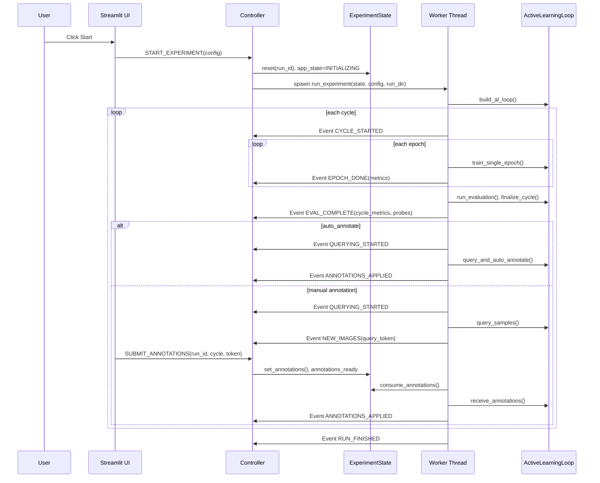

# Active Learning Framework Architecture Map

This document maps exactly where initialization happens, what each component does, and how components communicate during runtime.

## 1. System Overview

This project is a Streamlit UI + background worker architecture:

- UI thread (Streamlit) renders pages, handles user actions, and shows progress.
- Worker thread runs training/evaluation/query cycles.
- Shared `ExperimentState` is the single source of truth.
- Typed `Event` objects are the communication protocol from worker to UI/controller.

Core flow:

1. User configures experiment in sidebar.
2. Controller starts worker thread.
3. Worker runs active learning cycles and emits events.
4. Streamlit uses state-aware polling:
  - fast `0.5s` for `QUERYING`/`ANNOTATING`
  - slow `1.5s` for `INITIALIZING`/`TRAINING`/`STOPPING`
  - no periodic polling in `IDLE`/`FINISHED`/`ERROR`/`WAITING_STEP`
5. Controller applies event-driven state updates and UI re-renders by `AppState`.

## 2. Main Components and Responsibilities

### UI Entrypoint

- `app.py:136` `main()`: page config, session init, sidebar render, and polling-mode selection.
- `app.py:42` `init_session_state()`: initializes `config`, `controller`, and UI-local session keys once.
- `app.py:89` `_drain_inbox_and_render()`: drains worker events and routes to current view.
- `app.py:104` `_ensure_poll_mode_matches_state()`: switches between fast/slow/off polling when state changes.
- `app.py:116` `fast_live_update_fragment()`: `0.5s` polling for low-latency states.
- `app.py:123` `slow_live_update_fragment()`: `1.5s` polling for long-running states.
- `app.py:129` `static_render_fragment()`: render path without periodic polling.
- `app.py:75` `_handle_ui_effects()`: clears local annotation cache on lifecycle events.
- `app.py:62` `shutdown_handler()`: best-effort stop on process exit (`atexit` registered).

### Controller (UI <-> Worker Orchestrator)

- `controller.py:23` `Controller`: central command/event router.
- `controller.py:46` `dispatch()`: handles both:
  - UI -> controller commands (`START_EXPERIMENT`, `STOP_EXPERIMENT`, `NEXT_STEP`, `SUBMIT_ANNOTATIONS`)
  - Worker -> controller lifecycle events (`EPOCH_DONE`, `NEW_IMAGES`, etc.)
- `controller.py:186` `_handle_start()`: resets state, creates run directory, saves config, spawns thread.
- `controller.py:229` `_handle_stop()`: sets stop signals, unblocks waits, joins worker, finalizes state.
- `controller.py:262` `_handle_submit()`: validates `query_token`, accepts annotations for active run/cycle only.
- `controller.py:348` `process_inbox()`: drains inbox, filters stale events, dispatches accepted events.

### Shared State + Synchronization

- `experiment_state.py:32` `ExperimentState`: thread-safe shared state object.
- `experiment_state.py:18` `AppState`: lifecycle states (`IDLE`, `TRAINING`, `ANNOTATING`, etc.).
- State locks/events:
  - `self._lock` for atomic snapshot/update.
  - `stop_event`: cooperative cancellation.
  - `next_step_event`: step-mode gate.
  - `annotations_ready`: manual-annotation handshake.
- `experiment_state.py:103` `snapshot()`: atomic copy used by UI.
- `experiment_state.py:198` `update_for_run()`: safe run-scoped update.

### Worker Thread Orchestration

- `worker.py:213` `run_experiment()`: backend lifecycle loop.
- `worker.py:28` `build_al_loop()`: constructs dataset loaders, model, data manager, trainer, strategy, AL loop.
- `worker.py:101` `_emit_event()`: worker -> inbox event publishing.
- `worker.py:178` `_wait_for_next_step()`: step-mode blocking wait.
- `worker.py:189` `_flush_artifacts()`: final save of results/state/logs at stop/finish/error.
- `worker.py` incremental persistence: artifacts are also saved during the run (after cycle eval and annotation application).

### Active Learning Loop

- `active_loop.py:38` `ActiveLearningLoop`: per-run training/query/eval orchestration.
- `active_loop.py:246` `prepare_cycle()`: reset model, build labeled loader, initialize probes.
- `active_loop.py:288` `train_single_epoch()`: one epoch train/val.
- `active_loop.py:322` `run_evaluation()`: evaluate test set, optional cycle checkpoint.
- `active_loop.py:449` `query_samples()`: select uncertain samples + build rich queried payload.
- `active_loop.py:406` `query_and_auto_annotate()`: auto-label path without UI payload.
- `active_loop.py:609` `receive_annotations()`: apply annotation updates via data manager.
- `active_loop.py:638` `finalize_cycle()`: assemble cycle metrics + update probe predictions.

### Data, Training, and Strategies

- `dataloader.py:163` `get_datasets()`: dataset split (`train/val/test`) with transforms.
- `data_manager.py:42` `ALDataManager`: labeled/unlabeled pool index management.
- `trainer.py:29` `Trainer`: train/validate/evaluate/checkpoint/predictions.
- `strategies.py:206` `get_strategy()`: resolves uncertainty strategy function.
- `models.py:12` `get_model()`: loads TIMM model and moves to device.

### UI Views

- `views/router.py:19` `render()`: state-based router + tabs (`Main`, `Dataset Explorer`).
- `views/sidebar.py:422` `render_sidebar()`: config controls + Start/Stop/Next Step.
- `views/training.py:122` `render_training_view()`: live training charts/metrics.
- `views/gallery.py:277` `render_gallery_view()`: manual annotation UI and submit flow.
- `views/results.py:430` `render_results_view()`: disk-first run browser (current + previous runs from experiment folders).
- `views/explorer.py:46` `render_explorer_view()`: pool sizes and class distribution.

## 3. Initialization Map (Exact "where")

### App Process Initialization

1. `app.py` module import:
  - logging configured globally.
  - `atexit.register(shutdown_handler)` registered.
2. `main()` called:
  - `st.set_page_config(...)`.
  - `init_session_state()` called once per Streamlit session.

### Session Initialization (`init_session_state`)

At `app.py:42`:

1. `load_config()` from `config.py:213` loads and validates config:
  - Base `configs/default.yaml`
  - Optional overrides
  - Device resolution (`auto` -> `cuda`/`cpu`)
2. `Controller(config)` at `controller.py:23`.
3. Store in `st.session_state`:
  - `config`
  - `controller`
  - UI helper keys (`last_event_version`, annotation caches, etc.)

### Experiment Start Initialization

When user clicks Start (`views/sidebar.py:291` -> dispatch `START_EXPERIMENT`):

1. Sidebar builds override dict and creates fresh validated config via `load_config(...)`.
2. Controller `_handle_start()` (`controller.py:186`) does:
  - Stop prior run (best-effort).
  - Force `config.data.num_workers = 0` for Streamlit stability.
  - Sanitize experiment name for filesystem safety.
  - `state.reset(config)` to new `run_id`.
  - Mark state `INITIALIZING`.
  - Create run directory:
    - `{exp_dir}/{experiment_name}/{timestamp}_{run_id8}`
  - Save `config.yaml`.
  - Spawn daemon thread targeting `worker.run_experiment(...)`.

### Worker Backend Initialization

Inside `worker.py:28` `build_al_loop()`:

1. `get_datasets(...)`:
  - Reads ImageFolder-compatible dataset.
  - Filters hidden/system dirs.
  - Splits to train/val/test with seed.
2. Builds fixed `val_loader` and `test_loader`.
3. Loads model via `get_model(...)`.
4. Creates `ALDataManager` with **training split only** and initial labeled pool.
5. Creates `Trainer`.
6. Resolves sampling strategy.
7. Returns `ActiveLearningLoop`.

## 4. Runtime Communication Architecture

## 4.1 Two Communication Paths

### A) UI -> Controller (immediate dispatch)

- Triggered by buttons/forms in sidebar/gallery.
- Not queued through inbox.
- Entry point: `Controller.dispatch()`.

Command events:

- `START_EXPERIMENT`
- `STOP_EXPERIMENT`
- `NEXT_STEP`
- `SUBMIT_ANNOTATIONS`

### B) Worker -> Controller (inbox event queue)

- Worker emits typed events via `_emit_event(...)`.
- Stored in `ExperimentState.inbox` (`events.py:62`).
- UI uses state-aware polling and render paths:
  - fast fragment `app.py:116` (`run_every="0.5s"`)
  - slow fragment `app.py:123` (`run_every="1.5s"`)
  - static non-polling render `app.py:129`
- Each polling tick calls `controller.process_inbox(last_version)` in `app.py:89`.
- `controller.py:348` filters stale events by run/cycle and dispatches accepted events.

## 4.2 Event Queue Semantics

- `Event` payload is deep-copied + frozen (`events.py:47`) to avoid mutation races.
- `Inbox.put()` appends and increments version (`events.py:85`).
- `Inbox.drain(since_version)` returns new events and clears queue (`events.py:97`).
- UI stores `last_event_version` in session to fetch incremental updates.

## 4.3 Synchronization Primitives

- Stop:
  - Controller sets `stop_event`, `next_step_event`, `annotations_ready` on stop to unblock worker waits.
- Step mode:
  - Worker emits `WAITING_FOR_STEP`.
  - Controller `NEXT_STEP` sets `next_step_event`.
  - Worker resumes next cycle.
- Annotation handshake:
  - Worker emits `NEW_IMAGES` with `query_token`.
  - UI submits annotations with that token.
  - Controller validates token and run/cycle.
  - `ExperimentState.set_annotations(...)` sets `annotations_ready`.
  - Worker consumes annotations and continues.

## 4.4 Polling Mode Map (Implemented Option 3)

- Poll mode selection happens in `app.py:155` using current `AppState`.
- Mapping:
  - `fast` -> `QUERYING`, `ANNOTATING` (`app.py:21`)
  - `slow` -> `INITIALIZING`, `TRAINING`, `STOPPING` (`app.py:26`)
  - `off` -> `IDLE`, `FINISHED`, `ERROR`, `WAITING_STEP` (all others)
- Mode changes at runtime:
  - Poll fragment processes events.
  - `app.py:104` recomputes target mode.
  - On mismatch, `st.rerun()` is triggered to switch fragment type.

## 5. State Machine (AppState)

Defined in `experiment_state.py:18`.

Typical transitions:

1. `IDLE` -> `INITIALIZING` on `START_EXPERIMENT`
2. `INITIALIZING` -> `TRAINING` on `CYCLE_STARTED`
3. `TRAINING` -> `QUERYING` on `QUERYING_STARTED`
4. `QUERYING` -> `ANNOTATING` on `NEW_IMAGES` (manual mode)
5. `ANNOTATING` -> `TRAINING` (implicitly next cycle start after annotations applied)
6. `TRAINING` -> `WAITING_STEP` on `WAITING_FOR_STEP` (step mode only)
7. `WAITING_STEP` -> `TRAINING` on `NEXT_STEP`
8. Any active state -> `STOPPING` on `STOP_EXPERIMENT`
9. `STOPPING` -> `IDLE` when thread exits
10. Active -> `FINISHED` on `RUN_FINISHED`
11. Active -> `ERROR` on `RUN_ERROR`

Notes:

- Router view selection is state-driven (`views/router.py:46`).
- Sidebar button enable/disable logic is also state-driven (`views/sidebar.py:325`).

## 6. End-to-End Execution Sequences

## 6.1 Normal Auto-Annotate Cycle (default)

1. Start clicked -> controller starts worker thread.
2. Worker emits `CYCLE_STARTED`.
3. For each epoch:
  - train one epoch
  - emit `EPOCH_DONE`
  - early-stop check
4. Evaluate test set -> emit `EVAL_COMPLETE`.
5. If more cycles and unlabeled remains:
  - emit `QUERYING_STARTED`
  - run strategy
  - auto-annotate with ground-truth
  - emit `ANNOTATIONS_APPLIED`
6. Repeat next cycle.
7. End -> flush artifacts -> emit `RUN_FINISHED`.

## 6.2 Manual Annotation Cycle

Differs at query stage:

1. Worker queries samples and builds rich `queried_images` payload.
2. Emits `NEW_IMAGES` with one-time `query_token`.
3. UI shows gallery cards, user annotates, submits.
4. Controller validates token/run/cycle and stores annotations.
5. Worker waits on `annotations_ready`, consumes annotations, applies pool update.
6. Worker emits `ANNOTATIONS_APPLIED` and proceeds.

## 6.3 Step Mode Cycle Gating

- For cycles > 1, worker emits `WAITING_FOR_STEP` before training next cycle.
- UI must dispatch `NEXT_STEP`.
- Worker resumes only after `next_step_event` is set.

## 7. Data and Payload Flow

## 7.1 Config Flow

1. Loaded at startup from YAML + overrides.
2. Sidebar changes create new runtime overrides.
3. Start button creates fresh validated config.
4. Config saved to run directory (`config.yaml`) for reproducibility.

## 7.2 Dataset and Pool Flow

1. Dataset split into train/val/test once per run.
2. `ALDataManager` only manages train split indices:
  - `_labeled_list`
  - `_unlabeled_list`
3. Query strategy returns **relative indices in unlabeled pool**.
4. Data manager converts to absolute dataset indices and moves to labeled pool.

## 7.3 Metrics Flow

- Epoch metrics:
  - produced by `Trainer.train_single_epoch()`
  - emitted as `EPOCH_DONE`
  - appended to `state.epoch_metrics`.
- Cycle metrics:
  - produced by `ActiveLearningLoop.finalize_cycle()`
  - emitted as `EVAL_COMPLETE`
  - appended to `state.metrics_history`.
- Probe predictions:
  - updated at cycle finalize
  - serialized and emitted with `EVAL_COMPLETE`
  - shown in results dashboard.

## 7.4 Queried Images Flow (manual mode)

Payload built in `ActiveLearningLoop._build_queried_images(...)` includes:

- `image_id`, source path, cached display path
- ground truth label/name
- predicted class/confidence
- per-class probabilities
- uncertainty score
- human-readable selection reason

This payload is sent in `NEW_IMAGES` and consumed by `views/gallery.py`.

## 8. UI Page to Backend Mapping

### Sidebar (`views/sidebar.py`)

- Reads current snapshot (`controller.get_snapshot()`).
- On Start: dispatches `START_EXPERIMENT`.
- On Stop: dispatches `STOP_EXPERIMENT`.
- On Next Step: dispatches `NEXT_STEP`.

### Training View (`views/training.py`)

- Read-only render of:
  - `current_cycle`, `current_epoch`, `total_cycles`
  - `epoch_metrics`
  - `metrics_history` pool stats
- No backend writes.

### Gallery View (`views/gallery.py`)

- Reads `queried_images`, `class_names`, `query_token`.
- Writes UI-local annotation draft to `st.session_state.annotations`.
- On submit dispatches `SUBMIT_ANNOTATIONS` with run/cycle/token.

### Results View (`views/results.py`)

- Reads `metrics_history`, `probe_images`, `run_dir`, `class_names`.
- Can call `controller.save_state()` on export button (writes `state.json`).

### Explorer View (`views/explorer.py`)

- Read-only pool and class distribution dashboard from snapshot.

## 9. Persistence and Artifacts

Per-run directory artifacts:

- `config.yaml` (saved at start)
- `al_cycle_results.json` (all cycle summaries)
- `al_pool_state.json` (labeled/unlabeled indices + history)
- `training_history.json`, `training_log.txt`
- `checkpoints/`:
  - `best_model.pth`
  - optional `best_model_cycle_{n}.pth`
- `confusion_matrices/cycle_{n}.npy`
- `queries/cycle_{n}/...` cached queried images
- `cycle_{n}_annotations.json` for annotation summary

Persistence cadence:

- `al_cycle_results.json`, `al_pool_state.json`, and training logs are persisted incrementally during runs.
- Final flush still occurs on stop/finish/error.

Global snapshot artifact:

- `state.json` via `Controller.save_state()`.

## 10. Exact Event Map (Worker -> Controller)

Events emitted by worker (`worker.py`):

- `CYCLE_STARTED`
- `EPOCH_DONE`
- `EVAL_COMPLETE`
- `QUERYING_STARTED`
- `WAITING_FOR_STEP`
- `NEW_IMAGES`
- `ANNOTATIONS_APPLIED`
- `RUN_FINISHED`
- `RUN_STOPPED`
- `RUN_ERROR`

Controller handling is centralized in `controller.py:46` `dispatch()`, which updates `ExperimentState` fields relevant to each event.

## 11. Where to Trace During Debug/Presentation

If you need to live-walk through execution:

1. Start point:
  - `app.py:136` -> (`app.py:116` or `app.py:123` or `app.py:129`) -> `views/router.py:19`
2. Start command:
  - `views/sidebar.py:291` -> `controller.py:46` -> `controller.py:186`
3. Worker lifecycle:
  - `worker.py:213` loop and emitted events
4. State updates:
  - `controller.py:46` event match/case
  - `experiment_state.py:198` updates
5. Manual annotation handshake:
  - `worker.py` `NEW_IMAGES` emit
  - `views/gallery.py:187` submit
  - `controller.py:262` token validation
  - `experiment_state.py:160` set annotations

## 12. Design Rationale (Current)

- Decoupled UI and training compute via thread + typed events.
- Centralized state machine prevents ad-hoc UI condition logic.
- Adaptive fast/slow/off polling reduces idle overhead while preserving live feedback.
- Run-scoped IDs + token checks protect against stale submissions/races.
- Run artifact persistence supports reproducibility and thesis reporting.

## 13. Mermaid Sequence (Presentation Ready)

