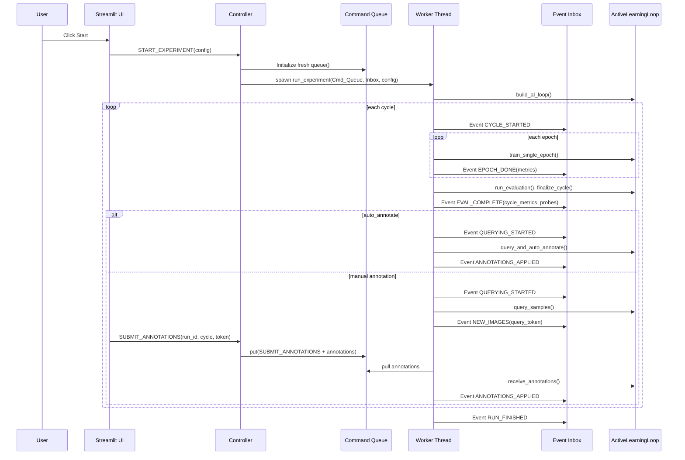

# Active Learning Framework — Architecture Map

This document is a precise reference for developers and supervisors. It maps every key component to its exact file and line number, explains responsibilities, and traces the full runtime communication flow.

---

## Quick Navigation

| What you want to find | Where to look |
|---|---|
| App entry point | [app.py:136](#ui-entrypoint) `main()` |
| Session init | [app.py:42](#ui-entrypoint) `init_session_state()` |
| Start experiment logic | [controller.py:187](#controller-ui--worker-orchestrator) `_handle_start()` |
| Worker main loop | [worker.py:267](#worker-thread-orchestration) `run_experiment()` |
| AL cycle logic | [active_loop.py:39](#active-learning-loop) `ActiveLearningLoop` |
| App states (IDLE, TRAINING…) | [experiment_state.py:19](#shared-state--synchronization) `AppState` |
| Event types | [events.py:24](#events) `EventType` |
| Manual annotation flow | [views/gallery.py:278](#gallery-view-viewsgallerypy) `render_gallery_view()` |
| Results/run browser | [views/results.py:430](#results-view-viewsresultspy) `render_results_view()` |
| Backend data structures | [state.py:12](#backend-data-structures-statepy) `EpochMetrics`, `CycleMetrics`, `QueriedImage`, `ProbeImage` |

---

## 1. System Overview

This project is a **Streamlit UI + background worker** architecture:

- **UI thread** (Streamlit): renders pages, handles user actions, shows progress.
- **Worker thread**: runs training / evaluation / query cycles independently.
- `ExperimentState` is the UI-owned dataclass controlled entirely by the Controller.
- Typed `Event` objects are the communication protocol **from worker to UI/controller**.
- `queue.Queue` command messages are the communication protocol **from UI to worker**.

**Core flow:**

1. User configures experiment in sidebar.
2. Controller starts worker thread.
3. Worker runs active learning cycles and emits typed events.
4. Streamlit uses state-aware polling:
   - **fast** `0.5 s` for `QUERYING` / `ANNOTATING`
   - **slow** `1.5 s` for `INITIALIZING` / `TRAINING` / `STOPPING`
   - **off** (no polling) for `IDLE` / `FINISHED` / `ERROR` / `WAITING_STEP`
5. Controller applies event-driven state updates; Streamlit re-renders via `AppState`.

---

## 2. File Index (all Python modules)

| File | Purpose |
|---|---|
| `app.py` | Streamlit entry point, polling fragments, session init |
| `controller.py` | Command/event router between UI and worker |
| `experiment_state.py` | Thread-safe UI state (`AppState` enum, `ExperimentState` dataclass) |
| `events.py` | `EventType` enum, `Event` dataclass, `Inbox` queue |
| `worker.py` | Worker thread: builds AL loop, emits events, handles commands |
| `active_loop.py` | Per-run training / query / evaluation orchestration |
| `state.py` | Backend data structures: `EpochMetrics`, `CycleMetrics`, `QueriedImage`, `ProbeImage` |
| `dataloader.py` | Dataset loading and train/val/test splits |
| `data_manager.py` | Labeled/unlabeled pool index management |
| `trainer.py` | Model training, validation, checkpointing, predictions |
| `strategies.py` | Uncertainty sampling strategy registry |
| `models.py` | TIMM model loader |
| `config.py` | Config loading from YAML + overrides |
| `views/router.py` | State-based view router |
| `views/sidebar.py` | Config controls + Start/Stop/Next Step buttons |
| `views/training.py` | Live training charts and metrics display |
| `views/gallery.py` | Manual annotation UI and submit flow |
| `views/results.py` | Disk-first run browser and cycle results dashboard |
| `views/explorer.py` | Pool sizes and class distribution dashboard |

---

## 3. Component Reference (with exact line numbers)

### UI Entrypoint

**`app.py`**

| Line | Function | What it does |
|---|---|---|
| `:42` | `init_session_state()` | Loads config, creates Controller, initializes all session keys — runs once per Streamlit session |
| `:62` | `shutdown_handler()` | Best-effort stop registered via `atexit` |
| `:75` | `_handle_ui_effects()` | Clears local annotation cache on lifecycle events |
| `:89` | `_drain_inbox_and_render()` | Drains worker events and routes to the current view |
| `:106` | `_ensure_poll_mode_matches_state()` | Switches fast/slow/off polling when state changes; triggers `st.rerun()` on mismatch |
| `:116` | `fast_live_update_fragment()` | `run_every="0.5s"` polling for low-latency states |
| `:123` | `slow_live_update_fragment()` | `run_every="1.5s"` polling for long-running states |
| `:129` | `static_render_fragment()` | Render path with no periodic polling |
| `:136` | `main()` | Page config → session init → sidebar render → poll mode selection |

Poll mode constants at top of file:

- `app.py:21` `FAST_POLL_STATES` = `{QUERYING, ANNOTATING}`
- `app.py:26` `SLOW_POLL_STATES` = `{INITIALIZING, TRAINING, STOPPING}`

---

### Controller (UI ↔ Worker Orchestrator)

**`controller.py`**

| Line | Method | What it does |
|---|---|---|
| `:24` | `class Controller` | Central command/event router |
| `:47` | `dispatch()` | Handles both UI→controller commands and Worker→UI lifecycle events |
| `:187` | `_handle_start()` | Resets state, creates run directory, saves config, creates `command_queue`, spawns worker thread |
| `:233` | `_handle_stop()` | Sends `{"command": "STOP"}` to the queue and joins worker |
| `:266` | `_handle_submit()` | Validates `query_token`, sends `{"command": "SUBMIT_ANNOTATIONS", "annotations": ...}` to worker |
| `:368` | `process_inbox()` | Drains inbox, filters stale events by run/cycle, dispatches accepted events |

---

### Shared State + Synchronization

**`experiment_state.py`**

| Line | Item | What it does |
|---|---|---|
| `:19` | `class AppState` | Lifecycle enum: `IDLE`, `INITIALIZING`, `TRAINING`, `QUERYING`, `ANNOTATING`, `WAITING_STEP`, `STOPPING`, `FINISHED`, `ERROR` |
| `:33` | `class ExperimentState` | Thread-safe UI state object — owned entirely by the Controller |
| `:100` | `snapshot()` | Returns an atomic copy of state for safe UI reads |
| `:162` | `update_for_run()` | Applies a worker event payload to the UI state |

**Communication channels:**

- `command_queue` (`queue.Queue`): UI → Worker. Carries `STOP`, `NEXT_STEP`, `SUBMIT_ANNOTATIONS`.
- `inbox` (`events.py Inbox`): Worker → UI. Accepts typed `Event` objects with version tracking.

---

### Events

**`events.py`**

| Line | Item | What it does |
|---|---|---|
| `:24` | `class EventType` | Enum of all 12 event types (10 worker→UI, 4 UI→controller commands) |
| `:47` | `class Event` | Immutable dataclass; payload deep-copied + frozen to avoid mutation races |
| `:62` | `class Inbox` | Thread-safe queue with version counter for incremental draining |

`Inbox` semantics:

- `put()`: appends event and increments version.
- `drain(since_version)`: returns new events since last read; UI stores `last_event_version` in session.

---

### Backend Data Structures (`state.py`)

**`state.py`** — backend-only dataclasses, no Streamlit dependency.

| Line | Class | What it contains |
|---|---|---|
| `:13` | `EpochMetrics` | `epoch`, `train_loss`, `train_accuracy`, `val_loss`, `val_accuracy`, `learning_rate` |
| `:39` | `CycleMetrics` | Full cycle summary: pool sizes, epochs trained, val/test accuracy, F1, precision, recall, confusion matrix path |
| `:77` | `QueriedImage` | Per-image query payload: path, ground truth, model probabilities, predicted class, uncertainty score, selection reason |
| `:112` | `ProbeImage` | Fixed validation probe: tracks how model predictions change across cycles |

---

### Worker Thread Orchestration

**`worker.py`**

| Line | Function | What it does |
|---|---|---|
| `:29` | `build_al_loop()` | Constructs dataset loaders, model, data manager, trainer, strategy, AL loop |
| `:102` | `_emit_event()` | Worker → `Inbox` event publishing |
| `:141` | `_wait_for_next_step()` | Blocks on `command_queue` until `NEXT_STEP` received (step mode) |
| `:236` | `_flush_artifacts()` | Final save of results/state/logs at stop/finish/error |
| `:267` | `run_experiment()` | Backend lifecycle loop: takes `command_queue` and `event_inbox`, runs cycles |

Incremental persistence also saves artifacts during the run (after cycle eval and after annotation application), not just at the end.

---

### Active Learning Loop

**`active_loop.py`**

| Line | Method | What it does |
|---|---|---|
| `:39` | `class ActiveLearningLoop` | Per-run training/query/eval orchestration |
| `:247` | `prepare_cycle()` | Resets model, builds labeled loader, initializes probes |
| `:305` | `train_single_epoch()` | One epoch train + val |
| `:339` | `run_evaluation()` | Evaluates test set; optional cycle checkpoint |
| `:423` | `query_and_auto_annotate()` | Auto-label path — no UI payload built |
| `:500` | `query_samples()` | Selects uncertain samples + builds rich `QueriedImage` payload for gallery |
| `:660` | `receive_annotations()` | Applies annotation updates via data manager |
| `:689` | `finalize_cycle()` | Assembles cycle metrics, updates probe predictions |

---

### Data, Training, and Strategies

| File | Line | Item | What it does |
|---|---|---|---|
| `dataloader.py` | `:163` | `get_datasets()` | Train/val/test split with transforms; filters hidden/system dirs |
| `data_manager.py` | `:42` | `class ALDataManager` | Manages `_labeled_list` / `_unlabeled_list` index pools for the train split only |
| `trainer.py` | `:29` | `class Trainer` | Train, validate, evaluate, checkpoint, and predict |
| `strategies.py` | `:206` | `get_strategy()` | Resolves uncertainty sampling strategy by name |
| `models.py` | `:12` | `get_model()` | Loads TIMM model and moves to device |

---

### UI Views

| File | Line | Function | What it renders |
|---|---|---|---|
| `views/router.py` | `:19` | `render()` | State-based router; selects tab set (Main / Results / Dataset Explorer) |
| `views/sidebar.py` | `:422` | `render_sidebar()` | Config controls + Start / Stop / Next Step buttons |
| `views/training.py` | `:122` | `render_training_view()` | Live training charts, epoch metrics, pool stats |
| `views/gallery.py` | `:278` | `render_gallery_view()` | Manual annotation cards; submit dispatches `SUBMIT_ANNOTATIONS` |
| `views/results.py` | `:430` | `render_results_view()` | Disk-first run browser; reads previous runs from experiment folders |
| `views/explorer.py` | `:46` | `render_explorer_view()` | Pool sizes and class distribution (read-only) |

---

## 4. Initialization Sequence

### 4.1 App Process Startup

1. `app.py` module import:
   - Logging configured globally.
   - `atexit.register(shutdown_handler)` registered.
2. `main()` called:
   - `st.set_page_config(...)`.
   - `init_session_state()` called once per Streamlit session.

### 4.2 Session Initialization (`init_session_state` — `app.py:42`)

1. `load_config()` (`config.py`) — loads `configs/default.yaml` + optional overrides; resolves device (`auto` → `cuda`/`cpu`).
2. `Controller(config)` created (`controller.py:24`).
3. Stored in `st.session_state`: `config`, `controller`, `last_event_version`, annotation caches, `poll_mode`.

### 4.3 Experiment Start (`_handle_start` — `controller.py:187`)

Triggered when user clicks **Start** (`views/sidebar.py` → dispatch `START_EXPERIMENT`):

1. Sidebar builds override dict and creates fresh validated config via `load_config(...)`.
2. Controller `_handle_start()`:
   - Stops any prior run (best-effort).
   - Forces `config.data.num_workers = 0` for Streamlit thread safety.
   - Sanitizes experiment name for filesystem.
   - Calls `state.reset(config)` → new `run_id`.
   - Sets state `INITIALIZING`.
   - Creates run directory: `{exp_dir}/{experiment_name}/{timestamp}_{run_id8}`.
   - Saves `config.yaml`.
   - Creates `command_queue` inside `ExperimentState`.
   - Spawns daemon thread → `worker.run_experiment(command_queue, inbox, config, run_dir, run_id)`.

### 4.4 Worker Backend Initialization (`build_al_loop` — `worker.py:29`)

1. `get_datasets()`: reads ImageFolder dataset, splits to train/val/test with seed.
2. Builds fixed `val_loader` and `test_loader`.
3. Loads model via `get_model()`.
4. Creates `ALDataManager` with **training split only** and initial labeled pool.
5. Creates `Trainer`.
6. Resolves uncertainty sampling strategy.
7. Returns `ActiveLearningLoop`.

---

## 5. Runtime Communication

### 5.1 Two Communication Paths

**A) UI → Controller (immediate dispatch)**

Triggered by buttons/forms in sidebar or gallery. Not queued through inbox.
Entry point: `Controller.dispatch()` (`controller.py:47`).

| Command | Source | What happens |
|---|---|---|
| `START_EXPERIMENT` | Sidebar Start button | `_handle_start()` spawns worker |
| `STOP_EXPERIMENT` | Sidebar Stop button | `_handle_stop()` sends STOP to queue |
| `NEXT_STEP` | Sidebar Next Step button | Sends NEXT_STEP to queue |
| `SUBMIT_ANNOTATIONS` | Gallery submit | `_handle_submit()` validates token, sends annotations to queue |

**B) Worker → Controller (inbox event queue)**

Worker emits typed events via `_emit_event()` (`worker.py:102`).
Stored in `ExperimentState.inbox` (`events.py:62`).
UI polls and drains via `controller.process_inbox(last_version)` (`controller.py:368`).

### 5.2 Polling Mode Map

Mode switching happens in `main()` at `app.py:155`.

| Mode | States | Streamlit fragment |
|---|---|---|
| `fast` | `QUERYING`, `ANNOTATING` | `fast_live_update_fragment()` — `run_every="0.5s"` |
| `slow` | `INITIALIZING`, `TRAINING`, `STOPPING` | `slow_live_update_fragment()` — `run_every="1.5s"` |
| `off` | `IDLE`, `FINISHED`, `ERROR`, `WAITING_STEP` | `static_render_fragment()` — no polling |

On mismatch, `st.rerun()` is triggered to swap fragment types.

### 5.3 Synchronization Primitives

**Stop:** Controller pushes `{"command": "STOP"}` → worker's `_check_stop()` returns `False` → clean exit.

**Step mode:** Worker emits `WAITING_FOR_STEP` → UI dispatches `NEXT_STEP` → worker resumes next cycle.

**Annotation handshake:**
1. Worker emits `NEW_IMAGES` with one-time `query_token`.
2. User annotates in gallery; submit dispatches `SUBMIT_ANNOTATIONS` with run/cycle/token.
3. Controller validates token → pushes `{"command": "SUBMIT_ANNOTATIONS", "annotations": ...}` to queue.
4. Worker unblocks from `_wait_for_annotations()`, applies pool update, emits `ANNOTATIONS_APPLIED`.

---

## 6. State Machine (`AppState`)

Defined in `experiment_state.py:19`.

```
IDLE
 └─ START_EXPERIMENT ──────────────────────────► INITIALIZING
                                                       │
                                              CYCLE_STARTED
                                                       │
                                                       ▼
                                                  TRAINING ◄──────────────────────┐
                                                    │   │                          │
                                           QUERYING_STARTED   WAITING_FOR_STEP    │
                                                    │              │               │
                                                    ▼              ▼               │
                                                QUERYING    WAITING_STEP           │
                                                    │              │               │
                                              NEW_IMAGES      NEXT_STEP            │
                                           (manual mode)          │               │
                                                    │              └───────────────┘
                                                    ▼
                                               ANNOTATING
                                                    │
                                          ANNOTATIONS_APPLIED
                                                    │
                                                    └──────────────────────────────┘
                                                                  (next cycle)
Any active state ──► STOP_EXPERIMENT ──► STOPPING ──► IDLE (thread exits)
Any active state ──► RUN_FINISHED ───────────────────► FINISHED
Any active state ──► RUN_ERROR ─────────────────────► ERROR
```

Router view selection is state-driven (`views/router.py:19`).
Sidebar button enable/disable is state-driven (`views/sidebar.py:422`).

---

## 7. Data and Payload Flow

### 7.1 Config Flow

1. Loaded at startup from `configs/default.yaml` + optional overrides.
2. Sidebar changes build runtime overrides dict.
3. Start button creates a fresh validated config.
4. Config saved to run directory (`config.yaml`) for reproducibility.

### 7.2 Dataset and Pool Flow

1. Full dataset split into train/val/test once per run (`dataloader.py:163`).
2. `ALDataManager` (`data_manager.py:42`) manages only the **train split**:
   - `_labeled_list`: indices of labeled samples.
   - `_unlabeled_list`: indices of unlabeled samples.
3. Query strategy returns **relative indices within the unlabeled pool**.
4. Data manager converts to absolute dataset indices and moves them to the labeled pool.

### 7.3 Metrics Flow

| Metric type | Produced by | Emitted as | Stored in |
|---|---|---|---|
| Epoch metrics | `Trainer.train_single_epoch()` | `EPOCH_DONE` | `state.epoch_metrics` |
| Cycle metrics | `ActiveLearningLoop.finalize_cycle()` | `EVAL_COMPLETE` | `state.metrics_history` |
| Probe predictions | `finalize_cycle()` | bundled with `EVAL_COMPLETE` | `state.probe_images` |

### 7.4 Queried Images Payload (manual mode)

Built by `query_samples()` (`active_loop.py:500`) using `QueriedImage` (`state.py:77`). Each entry includes:

- `image_id`, source path, cached display path
- Ground truth label/name
- Predicted class/confidence
- Per-class probabilities
- Uncertainty score
- Human-readable selection reason

Sent in `NEW_IMAGES` event → consumed by `views/gallery.py:278`.

---

## 8. Persistence and Artifacts

Per-run directory: `{exp_dir}/{experiment_name}/{timestamp}_{run_id8}/`

| Artifact | Description |
|---|---|
| `config.yaml` | Full config snapshot (saved at start) |
| `al_cycle_results.json` | All cycle summaries |
| `al_pool_state.json` | Labeled/unlabeled indices + history |
| `training_history.json` | Epoch metrics across all cycles |
| `training_log.txt` | Plaintext training log |
| `checkpoints/best_model.pth` | Best model weights |
| `checkpoints/best_model_cycle_{n}.pth` | Optional per-cycle checkpoints |
| `confusion_matrices/cycle_{n}.npy` | Confusion matrix arrays |
| `queries/cycle_{n}/` | Cached queried images for gallery display |
| `cycle_{n}_annotations.json` | Annotation summary per cycle |

**Persistence cadence:** `al_cycle_results.json`, `al_pool_state.json`, and training logs are written incrementally during the run (after cycle eval and after annotation application). A final flush also occurs on stop/finish/error (`worker.py:236`).

---

## 9. Event Reference (Worker → Controller)

All events defined in `events.py:24` (`EventType` enum).

| Event | Emitted when | State transition triggered |
|---|---|---|
| `CYCLE_STARTED` | Each cycle begins | `INITIALIZING` / `TRAINING` → `TRAINING` |
| `EPOCH_DONE` | Each training epoch completes | (metrics update, no state change) |
| `EVAL_COMPLETE` | Test set evaluated | (metrics + probes update) |
| `QUERYING_STARTED` | Query phase begins | `TRAINING` → `QUERYING` |
| `WAITING_FOR_STEP` | Step-mode gate | `TRAINING` → `WAITING_STEP` |
| `NEW_IMAGES` | Manual query ready | `QUERYING` → `ANNOTATING` |
| `ANNOTATIONS_APPLIED` | Pool updated | `ANNOTATING` → next `TRAINING` |
| `RUN_FINISHED` | All cycles complete | → `FINISHED` |
| `RUN_STOPPED` | Stop command honored | → `IDLE` |
| `RUN_ERROR` | Unhandled exception | → `ERROR` |

Controller handling centralized in `controller.py:47` `dispatch()`.

---

## 10. End-to-End Execution Sequences

### 10.1 Auto-Annotate Cycle (default)

1. Start clicked → controller spawns worker thread.
2. Worker calls `build_al_loop()` → emits `CYCLE_STARTED`.
3. For each epoch: train → emit `EPOCH_DONE` → check early stop.
4. Evaluate test set → emit `EVAL_COMPLETE`.
5. If cycles remain and unlabeled pool non-empty:
   - emit `QUERYING_STARTED`
   - run strategy → auto-annotate with ground truth
   - emit `ANNOTATIONS_APPLIED`
6. Repeat for next cycle.
7. End → `_flush_artifacts()` → emit `RUN_FINISHED`.

### 10.2 Manual Annotation Cycle

Differs at the query stage:

1. Worker queries samples via `query_samples()` → builds `QueriedImage` payload.
2. Emits `NEW_IMAGES` with one-time `query_token`.
3. UI shows gallery cards; user annotates and submits.
4. Controller validates token → drops annotations into `command_queue`.
5. Worker unblocks from `_wait_for_annotations()` → applies pool update.
6. Worker emits `ANNOTATIONS_APPLIED` → proceeds to next cycle.

### 10.3 Step Mode Gating

- For cycles > 1, worker emits `WAITING_FOR_STEP` before starting next training cycle.
- UI must dispatch `NEXT_STEP`.
- Worker resumes only after command received from queue.

---

## 11. Debug / Presentation Trace Points

| What to trace | Where to set breakpoint/log |
|---|---|
| App startup | `app.py:136` `main()` |
| Session init | `app.py:42` `init_session_state()` |
| Polling mode switch | `app.py:106` `_ensure_poll_mode_matches_state()` |
| Start command | `views/sidebar.py:422` → `controller.py:47` → `controller.py:187` |
| Worker lifecycle | `worker.py:267` `run_experiment()` |
| State updates | `controller.py:47` (match/case) + `experiment_state.py:162` `update_for_run()` |
| Manual annotation handshake | `worker.py` `NEW_IMAGES` emit → `views/gallery.py:278` → `controller.py:266` → `worker.py` `_wait_for_annotations()` |
| Artifact flush | `worker.py:236` `_flush_artifacts()` |

---

## 12. Design Rationale

- **Disconnected queue architecture**: worker is fully standalone — can run headless for batch testing without Streamlit.
- **Centralized UI dataclass** (`ExperimentState`): avoids complex variable scope lookups in Streamlit's re-render model.
- **Adaptive polling** (fast/slow/off): minimizes unnecessary rerenders during long training phases.
- **Run-scoped IDs + token checks**: protect against ghost-state submissions from stale UI sessions.
- **Incremental artifact persistence**: supports crash recovery and thesis reporting without requiring a clean finish.

---

## 13. Mermaid Sequence Diagram


