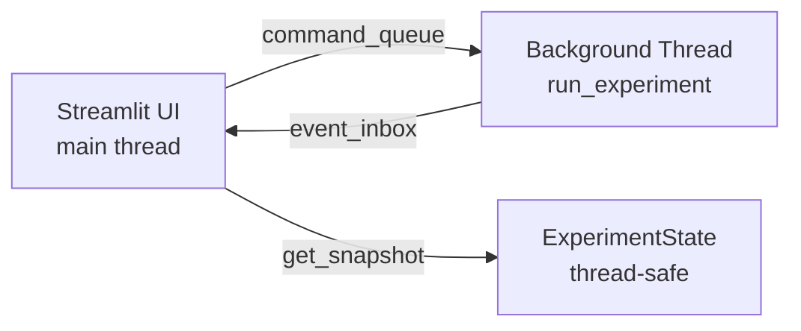
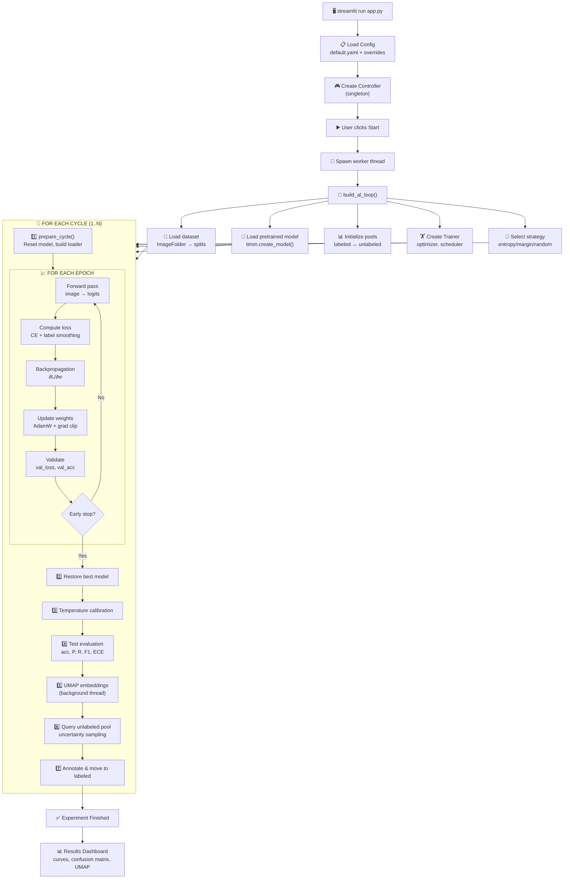

# The Journey of an Image: End-to-End Active Learning Pipeline Walkthrough

> [!NOTE]
> This document traces the complete life of an image — from the moment you click **Start Experiment** in the Streamlit UI to the final results dashboard — explaining every ML/DL concept applied along the way.

---

## Table of Contents

1. [Phase 0 — App Startup & Configuration](#phase-0--app-startup--configuration)
2. [Phase 1 — Dataset Loading & Splitting](#phase-1--dataset-loading--splitting)
3. [Phase 2 — Pool Initialization (Labeled vs. Unlabeled)](#phase-2--pool-initialization)
4. [Phase 3 — Model Creation (Transfer Learning)](#phase-3--model-creation-transfer-learning)
5. [Phase 4 — The Active Learning Loop](#phase-4--the-active-learning-loop)
   - [4a — Cycle Preparation & Model Reset](#4a--cycle-preparation--model-reset)
   - [4b — Training (Forward Pass, Loss, Backprop)](#4b--training-forward-pass-loss-backprop)
   - [4c — Validation & Early Stopping](#4c--validation--early-stopping)
   - [4d — Temperature Calibration](#4d--temperature-calibration)
   - [4e — Test Evaluation & Metrics](#4e--test-evaluation--metrics)
   - [4f — UMAP Embedding Visualization](#4f--umap-embedding-visualization)
   - [4g — Query Phase (Uncertainty Sampling)](#4g--query-phase-uncertainty-sampling)
   - [4h — Annotation & Pool Update](#4h--annotation--pool-update)
6. [Phase 5 — Results & Metrics Explained](#phase-5--results--metrics-explained)
7. [Visual Summary — Complete Flow Diagram](#visual-summary)

---

## Phase 0 — App Startup & Configuration

**Files involved:** [app.py](file:///c:/Users/amrfa/OneDrive%20-%20Fachhochschule%20Aachen/Active_learning/al-car-classification/app.py), [config.py](file:///c:/Users/amrfa/OneDrive%20-%20Fachhochschule%20Aachen/Active_learning/al-car-classification/config.py)

When you run `streamlit run app.py`:

1. **Streamlit initialises** the page layout (`wide` mode, sidebar expanded).
2. **`get_controller()`** is called as a `@st.cache_resource` — this means the `Controller` object is created **once** and survives browser refreshes.
3. Inside this function, **`load_config()`** fires:
   - Reads `configs/default.yaml` as the base configuration.
   - If an experiment-specific YAML is provided, it's deep-merged on top.
   - Runtime overrides from the sidebar UI (e.g. changing epochs) are merged last.
   - The config is **validated** — rejecting invalid ranges (e.g. `val_split >= 1.0`).
   - The **device** is auto-resolved: `"auto"` → `"cuda"` if a GPU is available, else `"cpu"`.
4. A `Controller` is created. At this point no experiment is running — the app is in the **IDLE** state.

> [!TIP]
> **DL Concept — Device Placement:** Placing the model on `"cuda"` means all tensor computations happen on the GPU, which parallelizes the matrix multiplications in convolutional and linear layers ~10-100× faster than CPU.

---

## Phase 1 — Dataset Loading & Splitting

**Files involved:** [dataloader.py](file:///c:/Users/amrfa/OneDrive%20-%20Fachhochschule%20Aachen/Active_learning/al-car-classification/ml/dataloader.py)

When you click **Start Experiment**, the worker thread calls `build_al_loop()` → which calls either `get_datasets()` or `get_datasets_presplit()` depending on whether a separate test directory is configured.

### 1.1 — Scanning the Folder Structure

Your images live in an **ImageFolder** layout:
```
data/
  train/
    AM_General_Hummer_SUV/
      image_001.jpg
      image_002.jpg
    Acura_RL_Sedan/
      ...
  test/
    AM_General_Hummer_SUV/
      ...
```

The `FilteredImageFolder` class scans all subdirectories, **filtering out** hidden folders (`.ipynb_checkpoints`, `.DS_Store`) and system folders (`__pycache__`). Each subfolder name becomes a **class label**, sorted alphabetically and mapped to integer indices: `{AM_General_Hummer_SUV: 0, Acura_RL_Sedan: 1, ...}`.

### 1.2 — Creating Splits

For the **pre-split** path (Stanford Cars):
- **Train** folder → shuffled with seed → carve out `val_split` (15%) as validation.
- **Test** folder → used as-is (the official test set).

For a single-folder setup:
- All indices are shuffled → split into **train** (70%), **val** (15%), **test** (15%).

### 1.3 — Transforms: What Happens to Each Pixel

Every image goes through **transforms** before the model sees it:

**Training Transform** (with augmentation):
```
RandomResizedCrop(224)  →  Random crop & resize to 224×224
RandomHorizontalFlip()  →  50% chance of mirror flip
RandomRotation(10)      →  ±10° rotation
ColorJitter(...)        →  Random brightness/contrast/saturation
ToTensor()              →  [H,W,C] uint8 → [C,H,W] float32 in [0,1]
Normalize(μ, σ)         →  channel-wise: (pixel - μ) / σ
```

**Evaluation Transform** (val/test):
```
Resize(256)             →  Resize shortest side to 256
CenterCrop(224)         →  Deterministic center crop to 224×224
ToTensor()              →  Same as above
Normalize(μ, σ)         →  Same ImageNet μ=[0.485, 0.456, 0.406], σ=[0.229, 0.224, 0.225]
```

> [!IMPORTANT]
> **DL Concept — Data Augmentation:** Training-time augmentations artificially increase dataset diversity. The model sees each image in slightly different forms each epoch — this acts as a regularizer that reduces overfitting, especially impactful when labeled data is scarce (exactly the active learning scenario).

> **DL Concept — ImageNet Normalization:** The mean and std values `([0.485, 0.456, 0.406], [0.229, 0.224, 0.225])` come from the ImageNet dataset statistics. Since the pretrained backbone was trained with these statistics, using them ensures the input distribution matches what the weights expect.

### 1.4 — The `ImageFolderWithIndex` Trick

A key architectural detail: a single `ImageFolderWithIndex` dataset wraps the entire data folder. When `__getitem__(idx)` is called:
- If `idx ∈ train_indices_set` → apply **train** transform (with augmentation)
- Otherwise → apply **eval** transform (deterministic)

This means the same underlying dataset serves all three splits, with **zero data copying**. Only integer index lists determine pool membership.

---

## Phase 2 — Pool Initialization

**File involved:** [data_manager.py](file:///c:/Users/amrfa/OneDrive%20-%20Fachhochschule%20Aachen/Active_learning/al-car-classification/ml/data_manager.py)

The `ALDataManager` splits the **training set** into two pools:

### 2.1 — Stratified Initialization

With `stratified_init=True` (default):
1. Group all train indices by class label (fast path: reads label from `samples[]` without loading images).
2. Pick **1 random sample per class** → guarantees every class is represented.
3. Fill remaining budget randomly from the rest.
4. Everything else → **unlabeled pool**.

Example with `initial_pool_size=400` and 196 classes:
```
Labeled pool:   400 images  (≥1 per class, rest randomly filled)
Unlabeled pool: ~7,600 images
```

> [!IMPORTANT]
> **ML Concept — Stratified Sampling:** Without stratification, rare classes might be entirely absent from the initial pool. A model trained without any examples of "Aston Martin Virage Convertible" could never learn that class. Stratification is critical for multi-class classification.

### 2.2 — Index-Based Pool Management

The pools are just **two Python lists of integers** — `_labeled_list` and `_unlabeled_list`. No images are copied or moved. This design means:
- Creating a `DataLoader` for the labeled pool = `PoolSubset(dataset, _labeled_list)` → only loads images at those indices.
- Moving a sample from unlabeled → labeled = move an integer between lists.

---

## Phase 3 — Model Creation (Transfer Learning)

**Files involved:** [models.py](file:///c:/Users/amrfa/OneDrive%20-%20Fachhochschule%20Aachen/Active_learning/al-car-classification/ml/models.py), [losses.py](file:///c:/Users/amrfa/OneDrive%20-%20Fachhochschule%20Aachen/Active_learning/al-car-classification/ml/losses.py)

### 3.1 — Loading a Pretrained Model

```python
model = timm.create_model("resnet50", pretrained=True, num_classes=196)
```

This does two things:
1. **Creates the ResNet-50 architecture** — a deep CNN with 50 layers organized into residual blocks.
2. **Loads ImageNet pretrained weights** — trained on 1.2M images across 1,000 classes.
3. **Replaces the final classification head** — the original 1000-class FC layer is swapped for a `Linear(2048, 196)` layer (196 car classes).

> **DL Concept — Transfer Learning:** The backbone (convolutional layers) has already learned to extract hierarchical features:
> - **Early layers:** edges, textures, color gradients
> - **Middle layers:** parts (wheels, headlights, grilles)
> - **Late layers:** object-level concepts (car shapes, body types)
> 
> Only the final classification head (a single fully-connected layer) needs to learn the mapping from these features to your 196 car classes. This is why the model can work well even with very few labeled samples.

### 3.2 — Model Architecture in Detail

```
ResNet-50 (simplified):
  Input: [B, 3, 224, 224]           ← batch of RGB images
  ├── conv1 (7×7, stride=2)         ← initial large receptive field
  ├── bn1 + relu + maxpool          ← normalize, activate, downsample
  ├── layer1 (3 bottleneck blocks)  ← [B, 256, 56, 56]
  ├── layer2 (4 bottleneck blocks)  ← [B, 512, 28, 28]
  ├── layer3 (6 bottleneck blocks)  ← [B, 1024, 14, 14]
  ├── layer4 (3 bottleneck blocks)  ← [B, 2048, 7, 7]
  ├── global_pool (avg)             ← [B, 2048]  ← "embedding vector"
  └── fc (Linear)                   ← [B, 196]   ← "logits"
```

> **DL Concept — Residual Connections:** Each bottleneck block computes `output = F(x) + x`. The `+ x` shortcut means the network can learn identity mappings trivially, solving the vanishing gradient problem that makes training very deep networks (50+ layers) possible.

### 3.3 — Optional: Supervised Contrastive Loss (SupCon)

If configured with `loss_fn="combined"`, a **ProjectionHead** is attached:
```
ProjectionHead:
  backbone features [B, 2048]
  → Linear(2048, 512) → ReLU
  → Linear(512, 128)
  → L2-normalize
  → [B, 128]  ← contrastive embedding space
```

> **DL Concept — Contrastive Learning:** SupCon Loss pulls embeddings of same-class images together and pushes different-class images apart in a normalized hypersphere. The combined loss: `L = (1-α)·CE + α·SupCon` teaches the backbone to build both discriminative features (via CE) and well-structured embedding spaces (via SupCon).

---

## Phase 4 — The Active Learning Loop

**Files involved:** [worker.py](file:///c:/Users/amrfa/OneDrive%20-%20Fachhochschule%20Aachen/Active_learning/al-car-classification/core/worker.py), [active_loop.py](file:///c:/Users/amrfa/OneDrive%20-%20Fachhochschule%20Aachen/Active_learning/al-car-classification/core/active_loop.py), [controller.py](file:///c:/Users/amrfa/OneDrive%20-%20Fachhochschule%20Aachen/Active_learning/al-car-classification/core/controller.py)

The experiment runs in a **background daemon thread** (`run_experiment()`), communicating with the Streamlit UI through:
- **command_queue** (UI → Worker): `STOP`, `NEXT_STEP`, `SUBMIT_ANNOTATIONS`
- **event_inbox** (Worker → UI): `CYCLE_STARTED`, `EPOCH_DONE`, `EVAL_COMPLETE`, etc.



The main loop iterates `num_cycles` (e.g. 10) times. Each cycle:

---

### 4a — Cycle Preparation & Model Reset

**`prepare_cycle(cycle_num)`** in [active_loop.py:259](file:///c:/Users/amrfa/OneDrive%20-%20Fachhochschule%20Aachen/Active_learning/al-car-classification/core/active_loop.py#L259)

1. **Initialize probe images** (cycle 1 only): 12 stratified samples from the validation set, tracked across cycles to visualize how predictions evolve.

2. **Reset model weights** based on `reset_mode`:

| Mode | What happens | When to use |
|------|-------------|-------------|
| `continue` | Cycle 1: freeze backbone, train head only. Cycle 2+: keep all weights, reset optimizer | Default — preserves learned knowledge |
| `pretrained` | Reload ImageNet weights every cycle | Independent experiments |
| `head_only` | Keep backbone, reset FC head | Fresh classifier each cycle |
| `none` | Keep everything, reset optimizer only | Maximum continuity |

3. **Build the labeled DataLoader** — wraps only the `_labeled_list` indices.

> [!IMPORTANT]
> **DL Concept — Backbone Freezing:** In cycle 1, the backbone (pretrained on ImageNet) is frozen. Only the new classification head trains. This prevents the random head gradients from corrupting the pretrained backbone features. After `freeze_backbone_epochs` (default: 2), the backbone unfreezes and full fine-tuning begins with **discriminative learning rates**: backbone LR = `learning_rate × 0.1`, head LR = `learning_rate`.

---

### 4b — Training (Forward Pass, Loss, Backprop)

**`train_single_epoch()`** in [trainer.py:367](file:///c:/Users/amrfa/OneDrive%20-%20Fachhochschule%20Aachen/Active_learning/al-car-classification/ml/trainer.py#L367)

For each mini-batch of labeled images:

#### Step 1: Forward Pass
```
image [B,3,224,224]
  → conv layers (feature extraction)
  → global_pool → [B,2048]  ← "feature embedding"
  → fc → [B,196]            ← "logits" (raw scores)
```

#### Step 2: Loss Computation

**Cross-Entropy with Label Smoothing:**
```
Standard CE:    L = -log(p_correct)
Smoothed CE:    L = -[(1-ε)·log(p_correct) + ε/(K)·Σlog(p_k)]
```
Where `ε=0.1` (label smoothing), `K=196` (number of classes).

> **DL Concept — Label Smoothing:** Instead of training the model to output 100% confidence for the correct class, label smoothing targets `[0.0005, ..., 0.9005, ..., 0.0005]`. This prevents the model from becoming overconfident, producing better-calibrated probabilities — which is directly important for uncertainty-based active learning.

#### Step 3: Backpropagation
```python
loss.backward()      # Compute ∂L/∂w for every parameter
clip_grad_norm_(...)  # Clip gradient magnitude to 1.0 (prevents exploding gradients)
optimizer.step()      # Update weights: w ← w - lr·∂L/∂w (with Adam momentum)
```

> **DL Concept — Gradient Clipping:** Active learning starts with very few labeled samples (maybe 400), so loss surfaces can be noisy. Gradient clipping caps the gradient magnitude at 1.0, preventing catastrophic weight updates from outlier batches.

#### Step 4: Learning Rate Schedule

- **Warmup** (first 2 epochs): LR ramps linearly from `lr × 0.1` to `lr`. This lets the optimizer "warm up" — needed because Adam's running averages are initialized to zero.
- **Cosine annealing** (remaining epochs): LR decays smoothly following `lr × (1 + cos(π·t/T))/2`, approaching zero at the final epoch. This is gentler than step decay and typically yields better convergence.

After each epoch, the trainer emits an `EPOCH_DONE` event with `EpochMetrics`:

| Metric | Description |
|--------|-------------|
| `train_loss` | Average cross-entropy loss over all training batches |
| `train_accuracy` | Fraction of correctly predicted training samples |
| `val_loss` | Same but computed on the validation set (no augmentation, no backprop) |
| `val_accuracy` | Validation accuracy — the primary metric for model selection |
| `learning_rate` | Current LR after scheduler step |

---

### 4c — Validation & Early Stopping

After each training epoch, the model is evaluated on the **validation set** (with `model.eval()` and `torch.no_grad()` — no gradients needed for inference).

**Best model checkpointing:**
```python
if val_acc > best_val_accuracy:
    save_checkpoint("best_model.pth")
    patience_counter = 0
else:
    patience_counter += 1
```

**Early stopping:** If `patience_counter >= early_stopping_patience` (default: 3 epochs without improvement), training stops. This prevents wasting compute on overfitting epochs.

> **ML Concept — Early Stopping as Regularization:** With small labeled pools, the model can memorize training data within a few epochs. Early stopping acts as implicit regularization — the model stops training before it overfits, using the validation set as the signal.

**After training completes**, the best checkpoint is restored:
```python
self.trainer.restore_best_model()  # Load best_model.pth weights
```

---

### 4d — Temperature Calibration

**`calibrate_temperature(val_loader)`** in [trainer.py:613](file:///c:/Users/amrfa/OneDrive%20-%20Fachhochschule%20Aachen/Active_learning/al-car-classification/ml/trainer.py#L613)

Before evaluation, the model's logits are **temperature-scaled** on the validation set:

```
scaled_logits = logits / T
scaled_probs = softmax(scaled_logits)
```

The optimal `T` is found by minimizing NLL using L-BFGS optimization. Typical learned `T` values:
- `T > 1.0` → softens probabilities (model was overconfident)
- `T < 1.0` → sharpens probabilities (model was underconfident)
- `T = 1.0` → no calibration needed

> [!TIP]
> **ML Concept — Temperature Scaling (Guo et al., 2017):** Modern neural networks are often poorly calibrated — a 90% confidence prediction may only be correct 70% of the time. Temperature scaling is a simple post-hoc fix that doesn't change predictions (same argmax), only adjusts probabilities to be more honest. This is particularly important for active learning because **query strategies rely on probability distributions** — miscalibrated probabilities lead to suboptimal sample selection.

---

### 4e — Test Evaluation & Metrics

**`evaluate(test_loader)`** in [trainer.py:499](file:///c:/Users/amrfa/OneDrive%20-%20Fachhochschule%20Aachen/Active_learning/al-car-classification/ml/trainer.py#L499)

The test set is evaluated **once per cycle** (never used during training). Here's what an image goes through:

```
image [1,3,224,224]  (eval transform: resize→center_crop→normalize)
  → model.forward()
  → logits [1,196]
  → softmax → probabilities [1,196]
  → argmax → predicted class
```

The following metrics are computed:

| Metric | Formula | Meaning |
|--------|---------|---------|
| **Accuracy** | `correct / total` | Overall percentage of correct predictions |
| **Precision** (weighted) | `TP / (TP + FP)` per class, weighted by class size | Of images predicted as class X, how many actually are X? |
| **Recall** (weighted) | `TP / (TP + FN)` per class, weighted by class size | Of images that are class X, how many did we find? |
| **F1** (weighted) | `2 × (P × R) / (P + R)` | Harmonic mean of precision and recall |
| **ECE** | Expected Calibration Error (15 bins) | How well do confidences match actual accuracy? |
| **ECE (calibrated)** | ECE after temperature scaling | Calibration quality post-correction |

**Per-class metrics** are also computed — precision, recall, F1 for each of the 196 classes.

> **ML Concept — ECE (Expected Calibration Error):**
> Split all predictions into 15 bins by confidence level. For each bin:
> ```
> ECE_bin = |avg_confidence_in_bin - actual_accuracy_in_bin|
> ```
> ECE = weighted average of all bins. A perfectly calibrated model has ECE = 0.
> 
> Example: If 100 predictions fall in the 80-87% confidence bin and only 60 are correct, that bin contributes `100 × |0.835 - 0.60| = 23.5` to the ECE numerator.

**Confusion Matrix:** A `[196×196]` numpy array is saved, where `cm[i][j]` counts how many images of true class `i` were predicted as class `j`. Diagonal = correct, off-diagonal = errors.

---

### 4f — UMAP Embedding Visualization

**`build_cycle_embeddings()`** in [embeddings.py:111](file:///c:/Users/amrfa/OneDrive%20-%20Fachhochschule%20Aachen/Active_learning/al-car-classification/ml/embeddings.py#L111)

After evaluation, the model's **penultimate layer features** (2048-D vectors from global_pool) are extracted for visualization:

1. **Extract features** for the labeled pool (all samples) and a **capped sample** of the unlabeled pool (max 2,000 — for performance).
2. **Extract using a forward hook** on `model.global_pool`:
   ```python
   hook = model.global_pool.register_forward_hook(capture_output)
   model(images)  # features captured mid-network
   ```
3. **Run UMAP** (in a background thread): project `[N, 2048]` → `[N, 2]`.
4. **Save** .npz with: 2D coordinates, class labels, pool membership (0=labeled, 1=unlabeled, 2=queried-this-cycle).

> **DL Concept — UMAP (Uniform Manifold Approximation and Projection):**
> UMAP constructs a topological representation of the high-dimensional data and finds a low-dimensional embedding that preserves the structure. In the resulting 2D plot:
> - **Same-class clusters** forming tightly → the model has learned good discriminative features.
> - **Classes merging** → the model confuses them (look at these in the confusion matrix too).
> - **Cycle-over-cycle**, clusters should tighten as more labeled data is added.
> 
> The `pool_membership` coloring lets you see WHERE the queried samples came from — they should ideally be near decision boundaries (between clusters), confirming the uncertainty strategy works.

---

### 4g — Query Phase (Uncertainty Sampling)

**`_select_query_indices()`** in [active_loop.py:371](file:///c:/Users/amrfa/OneDrive%20-%20Fachhochschule%20Aachen/Active_learning/al-car-classification/core/active_loop.py#L371), **strategies** in [strategies.py](file:///c:/Users/amrfa/OneDrive%20-%20Fachhochschule%20Aachen/Active_learning/al-car-classification/ml/strategies.py)

This is the **core of active learning** — choosing which unlabeled images to label next.

#### The Process:

1. Build a `DataLoader` for the entire unlabeled pool (using 2× batch size for faster inference since no gradients needed).
2. **Forward pass every unlabeled image** through the trained model:
   ```
   image → model → logits → softmax → probabilities [1, 196]
   ```
3. **Compute an uncertainty score** for each image using the chosen strategy.
4. **Select top-K** most uncertain images (`batch_size_al`, e.g. 400).

#### The Strategies:

**Entropy Sampling** (`strategy="entropy"`):
```
H(x) = -Σᵢ pᵢ · log(pᵢ)
```
- Maximum entropy = `log(196) ≈ 5.28` (uniform distribution — total confusion)
- Minimum entropy = `0` (100% confident in one class)
- **Select images with highest entropy**

> **Why it works:** High entropy means the probability mass is spread across many classes. The model genuinely doesn't know — labeling this image provides maximum information to disambiguate multiple classes at once.

**Least Confidence** (`strategy="least_confidence"` or `"uncertainty"`):
```
U(x) = 1 - max(p)
```
- Only looks at the **top-1 probability**
- **Select images with lowest max-probability** (highest uncertainty)

> **Difference from entropy:** Least confidence ignores the shape of the probability distribution. An image with `[0.4, 0.3, 0.3, 0, ...]` and an image with `[0.4, 0.001, 0.001, ..., 0.001]` have the same least-confidence score (0.6), but very different entropies.

**Margin Sampling** (`strategy="margin"`):
```
M(x) = P(ŷ₁) - P(ŷ₂)
```
where `ŷ₁, ŷ₂` are the top-2 predicted classes.
- **Select images with smallest margin** — the model can't decide between two classes.

> **When to use margin:** Margin is most powerful when errors tend to occur between specific class pairs (e.g., confusing "BMW 3 Series Sedan" with "BMW 5 Series Sedan"). It specifically targets the decision boundary between the two most likely classes.

**Random Sampling** (`strategy="random"` — baseline):
```
Select K random indices from the unlabeled pool
```
- No model inference needed — this is your control/baseline
- Active learning strategies should outperform this

#### After Selection:

Selected images are packaged into `QueriedImage` objects containing:
- Image path and ID
- Model's predicted class and confidence
- Full probability distribution across all 196 classes
- Uncertainty score
- Human-readable selection reason (e.g., "High entropy: 4.23")
- Ground truth label (used for auto-annotation)

A `QuerySummary` is saved with uncertainty statistics (min/max/mean/std), class distribution of queried batch, and top-10 most uncertain samples.

---

### 4h — Annotation & Pool Update

**Two modes:**

#### Auto-Annotate Mode (default: `auto_annotate=True`)

The ground truth labels are used directly — this simulates a "perfect oracle":
```python
annotations = [{"image_id": idx, "user_label": ground_truth_label} for idx in queried]
```

This is the standard approach for **AL simulation experiments** in research. The goal is to measure sampling strategy efficiency, not annotation quality.

#### Manual Annotation Mode

Images are displayed in the Streamlit UI gallery. The user (you) can:
1. View each queried image with the model's prediction and confidence
2. Confirm or correct the label
3. Submit annotations

**Pool Update** (in both modes):
```python
# 1. Find positions of queried images in unlabeled list
# 2. Move them: unlabeled → labeled
self._labeled_list.extend(absolute_indices)
self._unlabeled_list = [i for i in self._unlabeled_list if i not in absolute_set]
```

After annotation, **pool sizes change**:
```
Cycle 1: Labeled=400,  Unlabeled=7600
Cycle 2: Labeled=800,  Unlabeled=7200  (+400 queried)
Cycle 3: Labeled=1200, Unlabeled=6800  (+400 queried)
...
```

> [!IMPORTANT]
> **ML Concept — Active Learning vs. Random Learning:** The entire thesis question: does training on 2,000 *strategically selected* images perform as well as training on 4,000 *randomly selected* images? If yes, active learning halves the annotation cost — a significant real-world saving when labeling is expensive (e.g., medical images, autonomous driving).

---

## Phase 5 — Results & Metrics Explained

### CycleMetrics — What Gets Recorded Per Cycle

After each cycle completes, a `CycleMetrics` object is created ([state.py:39](file:///c:/Users/amrfa/OneDrive%20-%20Fachhochschule%20Aachen/Active_learning/al-car-classification/core/state.py#L39)):

| Field | Description | What to look for |
|-------|-------------|-----------------|
| `cycle` | Cycle number (1-indexed) | — |
| `labeled_pool_size` | How many labeled images | Should grow linearly |
| `unlabeled_pool_size` | How many remain unlabeled | Should shrink linearly |
| `epochs_trained` | Actual epochs (may be < configured due to early stopping) | Low values = model converges quickly (or pool too small) |
| `best_val_accuracy` | Best validation accuracy in this cycle | Primary model selection metric |
| `best_epoch` | Which epoch was best | If always = max epochs → might need more epochs |
| `test_accuracy` | Test set accuracy | **The key metric** — should increase with cycles |
| `test_f1` | Weighted F1 score | Better than accuracy for imbalanced classes |
| `test_precision` | Weighted precision | High = few false positives |
| `test_recall` | Weighted recall | High = few missed true positives |
| `ece` | Expected Calibration Error | Lower = better calibrated probabilities |
| `per_class_metrics` | P/R/F1 for each of 196 classes | Shows which classes the model struggles with |
| `confusion_matrix_path` | Path to saved confusion matrix | Visual analysis of class confusions |
| `embeddings_path` | Path to UMAP .npz file | Track feature space evolution |

### Interpreting the Learning Curve

The most important chart in your results dashboard:

```
Test Accuracy vs. Labeled Pool Size

     100% ─
      90% ─          ╱────── entropy
      80% ─        ╱     ╱── random
      70% ─      ╱     ╱
      60% ─    ╱     ╱
      50% ─  ╱    ╱
      40% ─╱  ╱
           ┼─┼──┼──┼──┼──┼──┼──┼──┼──┼
          400 800 1200 ... 4000
                Labeled samples
```

**The gap between entropy and random** = the value of active learning. A wider gap means:
- Smarter sampling is paying off
- You're getting more accuracy per labeled sample
- In practice: fewer annotation $$$ needed for the same performance

### How the Dashboard Stays Updated

The UI polls events from the worker thread using **Streamlit fragments**:

- **Fast polling** (0.5s): during querying and annotating (quick state changes)
- **Slow polling** (1.5s): during training and init (longer operations)
- **No polling**: when idle or finished

Each poll calls `controller.process_inbox()` which drains events, validates they match the current run, dispatches them to update `ExperimentState`, and triggers a UI re-render.

---

## Visual Summary



---

## Summary: What Happens to a Single Image

Let's trace one concrete image — say `AM_General_Hummer_SUV/00123.jpg`:

| Stage | What happens | Result |
|-------|-------------|--------|
| **Load** | Scanned by ImageFolder, gets index `4217` and label `0` | `dataset.samples[4217] = ("path/00123.jpg", 0)` |
| **Split** | Index `4217` falls in train_indices (70%) | Part of training pool |
| **Pool init** | Index `4217` randomly assigned to unlabeled (not in initial 400) | Unlabeled pool |
| **Cycle 1** | Not used for training. Forward-passed during querying. | Entropy = 3.2 (not selected — only top-400 queried) |
| **Cycle 2** | Forward-passed again. Entropy = 4.8 (model uncertain!) | **Selected for labeling!** |
| **Annotation** | Auto-annotated with ground truth label `0` | Moved to labeled pool |
| **Cycle 3+** | Now part of training data. Goes through augmented transform. | Contributes to model learning |
| **Each training batch** | Random crop, flip, rotate, color jitter → tensor → normalize → forward → loss → backprop | Weights updated to classify Hummers better |
| **Evaluation** | Center-cropped, fed through model, prediction compared to truth | Contributes to test accuracy |
| **UMAP** | 2048-D embedding extracted, projected to 2D | Visible as a point in the embedding plot |
